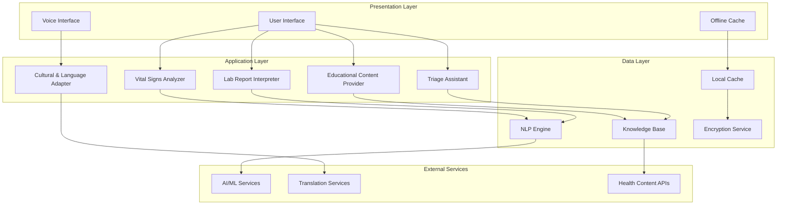

# Design Document: Arcadia Health AI-Powered Healthcare Assistant

## Overview

Arcadia Health is designed as a modular, AI-powered healthcare assistant ecosystem specifically tailored for users in rural and semi-urban India. The system follows a layered architecture that prioritizes accessibility, cultural sensitivity, and offline capability while maintaining strict boundaries around medical advice.

The design emphasizes educational guidance over diagnostic capabilities, using natural language processing to interpret medical data and present it in culturally appropriate, simple language. The system operates under the principle of "augmenting health literacy, not replacing medical judgment."

Key architectural principles:
- **Modular design** for maintainability and scalability
- **Offline-first approach** for areas with poor connectivity
- **Cultural adaptation layer** for localized communication
- **Privacy-by-design** for sensitive health data
- **Progressive disclosure** of information based on user literacy levels

## Architecture

The system follows a three-tier architecture with specialized components for healthcare data processing:



### Layer Responsibilities

**Presentation Layer:**
- Adaptive user interface supporting multiple input modalities
- Voice interface for users with limited literacy
- Offline caching for essential functionality during connectivity issues

**Application Layer:**
- Domain-specific processing modules for different health data types
- Cultural adaptation ensuring appropriate communication styles
- Business logic enforcement preventing diagnostic overreach

**Data Layer:**
- Secure data processing and storage with encryption
- Knowledge base management for health education content
- NLP pipeline for medical text processing

## Components and Interfaces

### Lab Report Interpreter

**Purpose:** Processes uploaded lab reports and extracts key health metrics for user-friendly explanation.

**Core Functions:**
- Document parsing using OCR for scanned reports
- Medical value extraction and normalization
- Reference range comparison and flagging
- Simple language explanation generation

**Interface:**
```typescript
interface LabReportInterpreter {
  parseReport(document: File): Promise<ParsedReport>
  extractMetrics(parsedReport: ParsedReport): HealthMetric[]
  explainMetrics(metrics: HealthMetric[], userProfile: UserProfile): Explanation[]
  flagAbnormalValues(metrics: HealthMetric[]): AbnormalValue[]
}

interface ParsedReport {
  patientInfo: PatientInfo
  testResults: TestResult[]
  reportDate: Date
  labFacility: string
}

interface HealthMetric {
  name: string
  value: number | string
  unit: string
  referenceRange: Range
  category: MetricCategory
}
```

**Processing Pipeline:**
1. Document upload and format validation
2. OCR processing for scanned documents
3. Text extraction and medical entity recognition
4. Value normalization and reference range lookup
5. Explanation generation in simple language
6. Cultural adaptation of explanations

### Vital Signs Analyzer

**Purpose:** Analyzes user-inputted vital signs and provides educational context about their meanings.

**Core Functions:**
- Input validation for vital sign measurements
- Trend analysis for historical data
- Normal range comparison
- Educational content delivery

**Interface:**
```typescript
interface VitalSignsAnalyzer {
  validateInput(vitalSigns: VitalSignInput): ValidationResult
  analyzeVitalSigns(vitalSigns: VitalSignInput): VitalSignAnalysis
  generateTrends(historicalData: VitalSignInput[]): TrendAnalysis
  explainSignificance(analysis: VitalSignAnalysis, userProfile: UserProfile): Explanation
}

interface VitalSignInput {
  bloodPressure?: BloodPressure
  heartRate?: number
  temperature?: number
  oxygenSaturation?: number
  timestamp: Date
}

interface VitalSignAnalysis {
  metrics: AnalyzedMetric[]
  overallAssessment: AssessmentLevel
  educationalContent: string[]
  trendIndicators: TrendIndicator[]
}
```

### Triage Assistant

**Purpose:** Provides guidance on healthcare urgency levels without diagnosing conditions.

**Core Functions:**
- Symptom assessment using structured questionnaires
- Urgency level determination
- Healthcare facility recommendations
- Emergency situation identification

**Interface:**
```typescript
interface TriageAssistant {
  assessSymptoms(symptoms: SymptomInput[]): TriageAssessment
  determineUrgency(assessment: TriageAssessment): UrgencyLevel
  recommendCare(urgency: UrgencyLevel, location: Location): CareRecommendation
  identifyEmergency(symptoms: SymptomInput[]): EmergencyAlert | null
}

interface TriageAssessment {
  urgencyScore: number
  riskFactors: RiskFactor[]
  recommendedActions: Action[]
  timeframe: string
}

enum UrgencyLevel {
  EMERGENCY = "immediate",
  URGENT = "within_24_hours", 
  ROUTINE = "within_week"
}
```

### Educational Content Provider

**Purpose:** Delivers culturally appropriate health education content.

**Core Functions:**
- Content retrieval based on user queries
- Cultural adaptation of medical information
- Progressive disclosure based on user literacy
- Multi-language content delivery

**Interface:**
```typescript
interface EducationalContentProvider {
  getContent(topic: string, userProfile: UserProfile): EducationalContent
  adaptContent(content: EducationalContent, culturalContext: CulturalContext): AdaptedContent
  generateExplanation(medicalTerm: string, simplificationLevel: number): string
  searchContent(query: string, filters: ContentFilter[]): SearchResult[]
}

interface EducationalContent {
  title: string
  content: string
  complexity: ComplexityLevel
  culturalAdaptations: CulturalAdaptation[]
  relatedTopics: string[]
}
```

### Cultural & Language Adapter

**Purpose:** Ensures culturally appropriate communication and multi-language support.

**Core Functions:**
- Language detection and translation
- Cultural context adaptation
- Communication style adjustment
- Local health practice integration

**Interface:**
```typescript
interface CulturalLanguageAdapter {
  detectLanguage(input: string): Language
  translateContent(content: string, targetLanguage: Language): string
  adaptCulturally(content: string, culturalContext: CulturalContext): string
  adjustCommunicationStyle(content: string, userProfile: UserProfile): string
}

interface CulturalContext {
  region: string
  primaryLanguage: Language
  educationLevel: EducationLevel
  healthBeliefs: HealthBelief[]
  localPractices: LocalPractice[]
}
```

## Data Models

### Core Data Structures

**User Profile:**
```typescript
interface UserProfile {
  id: string
  preferredLanguage: Language
  educationLevel: EducationLevel
  location: Location
  culturalContext: CulturalContext
  accessibilityNeeds: AccessibilityNeed[]
  communicationPreferences: CommunicationPreference[]
}
```

**Health Data:**
```typescript
interface HealthData {
  userId: string
  dataType: HealthDataType
  timestamp: Date
  values: HealthValue[]
  source: DataSource
  privacy: PrivacyLevel
}

interface HealthValue {
  metric: string
  value: any
  unit?: string
  confidence: number
  interpretation: Interpretation
}
```

**Explanation Framework:**
```typescript
interface Explanation {
  content: string
  simplificationLevel: number
  culturalAdaptations: string[]
  visualAids: VisualAid[]
  audioContent?: AudioContent
  relatedEducation: string[]
}

interface VisualAid {
  type: VisualType
  content: string
  description: string
  culturallyAppropriate: boolean
}
```

### Data Processing Pipeline

The system processes health data through a standardized pipeline:

1. **Input Validation:** Ensures data integrity and format compliance
2. **Normalization:** Converts values to standard units and formats
3. **Context Enrichment:** Adds cultural and linguistic context
4. **Interpretation Generation:** Creates user-appropriate explanations
5. **Privacy Application:** Applies appropriate privacy controls
6. **Caching:** Stores processed data for offline access

### Privacy and Security Model

All health data follows a privacy-by-design approach:

- **Encryption at rest and in transit** using AES-256
- **Minimal data retention** with automatic purging
- **User consent management** with granular controls
- **Anonymization** for analytics and improvement
- **Audit logging** for compliance and security monitoring

## Correctness Properties

*A property is a characteristic or behavior that should hold true across all valid executions of a system—essentially, a formal statement about what the system should do. Properties serve as the bridge between human-readable specifications and machine-verifiable correctness guarantees.*

Based on the requirements analysis, the following properties ensure the system operates correctly and safely:

### Property 1: Medical Safety Boundary
*For any* system output (explanations, educational content, or triage guidance), the content should never contain medical diagnosis language, specific treatment recommendations, or prescription advice.
**Validates: Requirements 1.4, 3.3, 4.3**

### Property 2: Simple Language Generation
*For any* generated explanation or educational content, the text should use simple language patterns, avoid medical jargon, and be appropriate for general audiences with basic literacy.
**Validates: Requirements 1.2, 2.2, 3.1, 6.3**

### Property 3: Data Processing Accuracy
*For any* valid health data input (lab reports, vital signs), the system should successfully parse, extract, and process the data according to the expected format specifications.
**Validates: Requirements 1.1, 1.5, 2.1, 2.4**

### Property 4: Abnormal Value Detection
*For any* health metric with values outside normal ranges, the system should flag the abnormality and provide educational context without diagnostic interpretation.
**Validates: Requirements 1.3, 2.3**

### Property 5: Cultural Appropriateness
*For any* generated content, explanations should use culturally appropriate analogies, examples, and context suitable for rural and semi-urban Indian users.
**Validates: Requirements 3.4, 7.2, 7.4**

### Property 6: Triage Categorization
*For any* symptom input, the triage system should assign exactly one urgency level (immediate, urgent, or routine) and provide appropriate care guidance.
**Validates: Requirements 4.1, 4.2, 4.5**

### Property 7: Emergency Detection
*For any* symptom pattern indicating emergency conditions, the system should clearly advise seeking immediate medical attention.
**Validates: Requirements 4.4**

### Property 8: Language Support Consistency
*For any* supported language, the system should provide consistent translations and culturally adapted communication styles.
**Validates: Requirements 7.1, 7.3, 7.5**

### Property 9: Data Security
*For any* health data operation, the system should apply proper encryption during transmission and storage, and enforce data retention policies.
**Validates: Requirements 6.1, 6.2, 6.4**

### Property 10: Accessibility Features
*For any* user interface interaction, the system should support voice input/output and provide clear visual indicators with minimal text.
**Validates: Requirements 5.2, 5.3**

### Property 11: Offline Functionality
*For any* previously accessed content, the system should provide offline access when network connectivity is poor or intermittent.
**Validates: Requirements 8.1, 8.2**

### Property 12: Error Handling
*For any* system error or failure condition, the system should provide clear, non-technical error messages and gracefully degrade functionality rather than failing completely.
**Validates: Requirements 5.4, 8.4**

### Property 13: Performance Requirements
*For any* user input under normal conditions, the system should respond within 5 seconds.
**Validates: Requirements 8.3**

## Error Handling

The system implements a comprehensive error handling strategy that prioritizes user safety and system reliability:

### Error Categories

**Input Validation Errors:**
- Invalid file formats for lab reports
- Out-of-range vital sign values
- Malformed user inputs
- Unsupported language requests

**Processing Errors:**
- OCR failures on scanned documents
- NLP processing failures
- Translation service unavailability
- AI service timeouts

**System Errors:**
- Network connectivity issues
- Database connection failures
- Authentication/authorization failures
- Resource exhaustion

### Error Handling Patterns

**Graceful Degradation:**
- When AI services are unavailable, fall back to rule-based processing
- When translation services fail, provide content in default language with notification
- When network is poor, serve cached content with offline indicators

**User-Friendly Messaging:**
- All error messages use simple, non-technical language
- Errors include suggested actions for resolution
- Critical errors (potential safety issues) are escalated with clear warnings

**Safety-First Approach:**
- Any processing error that could affect medical interpretation results in conservative messaging
- Uncertain results are clearly marked as requiring professional medical consultation
- System failures default to recommending professional medical advice

### Recovery Mechanisms

**Automatic Retry:**
- Network requests with exponential backoff
- Failed processing attempts with alternative methods
- Temporary service failures with queued retry

**Manual Recovery:**
- User-initiated retry options for failed operations
- Alternative input methods when primary methods fail
- Offline mode activation for extended connectivity issues

## Testing Strategy

The testing approach combines traditional unit testing with property-based testing to ensure comprehensive coverage and correctness validation.

### Dual Testing Approach

**Unit Tests:**
- Specific examples demonstrating correct behavior
- Edge cases and boundary conditions
- Integration points between components
- Error conditions and failure scenarios
- Cultural adaptation examples
- Language-specific functionality

**Property-Based Tests:**
- Universal properties verified across randomized inputs
- Safety boundary enforcement across all content types
- Data processing accuracy across various input formats
- Cultural appropriateness across different user profiles
- Performance characteristics under varying conditions

### Property-Based Testing Configuration

The system uses **Hypothesis** (Python) for property-based testing with the following configuration:
- **Minimum 100 iterations** per property test to ensure statistical confidence
- **Custom generators** for health data, user profiles, and cultural contexts
- **Shrinking strategies** to find minimal failing examples
- **Seed management** for reproducible test runs

Each property test includes a comment tag referencing the design document:
```python
# Feature: arcadia-health, Property 1: Medical Safety Boundary
```

### Test Data Generation

**Health Data Generators:**
- Lab report formats from major Indian healthcare facilities
- Vital sign measurements across normal and abnormal ranges
- Symptom descriptions covering common health concerns
- User profiles representing diverse demographics

**Cultural Context Generators:**
- Regional language variations
- Educational background diversity
- Cultural belief systems
- Local health practice variations

### Integration Testing

**End-to-End Scenarios:**
- Complete user journeys from data input to explanation delivery
- Multi-language content delivery workflows
- Offline-to-online synchronization processes
- Error recovery and graceful degradation scenarios

**Performance Testing:**
- Response time validation under various load conditions
- Memory usage patterns with large datasets
- Network resilience testing with simulated connectivity issues
- Scalability testing for concurrent user scenarios

### Safety Testing

**Medical Safety Validation:**
- Automated scanning for diagnostic language in all outputs
- Treatment recommendation detection across all content
- Emergency situation handling verification
- Boundary condition testing for medical advice prevention

**Cultural Sensitivity Testing:**
- Content appropriateness validation across cultural contexts
- Language translation accuracy and consistency
- Regional adaptation effectiveness
- Bias detection in AI-generated content

The testing strategy ensures that Arcadia Health maintains its educational focus while providing reliable, culturally appropriate health information to users across diverse contexts and technical capabilities.