# Arcadia Health - System Diagrams

Complete visual documentation of the Arcadia Health platform.

---

## 1. Process Flow Diagram

### User Journey Flow


### Data Processing Flow


---

## 2. Use Case Diagram


---

## 3. System Architecture Diagram

### High-Level Architecture

```mermaid
graph TB
    subgraph "Client Layer"
        Browser[Web Browser]
        Mobile[Mobile Browser]
    end
    
    subgraph "Presentation Layer - React + Vite"
        Landing[Landing Page]
        Dashboard[Dashboard]
        Patients[Patient Management]
        AI[AI Assistant]
        Components[Reusable Components]
    end
    
    subgraph "API Gateway"
        Router[Express Router]
        Auth[Authentication Middleware]
        CORS[CORS Handler]
        RateLimit[Rate Limiter]
    end
    
    subgraph "Application Layer - Node.js"
        subgraph "Controllers"
            AuthCtrl[Auth Controller]
            PatientCtrl[Patient Controller]
            DashboardCtrl[Dashboard Controller]
            AICtrl[AI Controller]
        end
        
        subgraph "Services"
            LabInterpreter[Lab Report Interpreter]
            VitalAnalyzer[Vital Signs Analyzer]
            TriageAssist[Triage Assistant]
            ContentProvider[Educational Content]
            CulturalAdapter[Cultural Adapter]
        end
    end
    
    subgraph "Data Layer"
        Cache[Redis Cache - Optional]
        Memory[In-Memory Store]
        MongoDB[(MongoDB - Optional)]
    end
    
    subgraph "External Services"
        AI_API[AI/ML Services]
        Translation[Translation API]
        OCR[OCR Service]
    end
    
    subgraph "Security Layer"
        Encryption[AES-256 Encryption]
        JWT[JWT Token Service]
        Validation[Input Validation]
    end
    
    Browser --> Landing
    Mobile --> Landing
    Landing --> Router
    Dashboard --> Router
    Patients --> Router
    AI --> Router
    
    Router --> Auth
    Auth --> CORS
    CORS --> RateLimit
    
    RateLimit --> AuthCtrl
    RateLimit --> PatientCtrl
    RateLimit --> DashboardCtrl
    RateLimit --> AICtrl
    
    AuthCtrl --> JWT
    PatientCtrl --> LabInterpreter
    PatientCtrl --> VitalAnalyzer
    DashboardCtrl --> Memory
    AICtrl --> TriageAssist
    AICtrl --> ContentProvider
    
    LabInterpreter --> OCR
    VitalAnalyzer --> AI_API
    TriageAssist --> AI_API
    ContentProvider --> Translation
    CulturalAdapter --> Translation
    
    LabInterpreter --> Encryption
    VitalAnalyzer --> Encryption
    
    Encryption --> Cache
    Encryption --> Memory
    Encryption --> MongoDB
    
    JWT --> Validation
    
    style "Presentation Layer - React + Vite" fill:#06b6d4
    style "Application Layer - Node.js" fill:#a855f7
    style "Data Layer" fill:#10b981
    style "Security Layer" fill:#ef4444
```

### Detailed Component Architecture

```mermaid
graph LR
    subgraph "Frontend Architecture"
        subgraph "Pages"
            LP[Landing Page]
            DP[Dashboard Page]
            PP[Patients Page]
            PD[Patient Detail]
            AP[AI Assistant]
            SP[Settings Page]
        end
        
        subgraph "Components"
            Nav[Navbar]
            Side[Sidebar]
            Bento[Bento Grid]
            Charts[Chart Components]
            Forms[Form Components]
        end
        
        subgraph "Context"
            AuthCtx[Auth Context]
            ToastCtx[Toast Context]
        end
        
        subgraph "Services"
            API[API Client]
            Storage[Local Storage]
        end
    end
    
    subgraph "Backend Architecture"
        subgraph "Routes"
            AuthRoute[/api/auth]
            PatientRoute[/api/patients]
            DashRoute[/api/dashboard]
            AIRoute[/api/ai]
        end
        
        subgraph "Middleware"
            AuthMid[Auth Middleware]
            ErrorMid[Error Handler]
            ValidMid[Validator]
        end
        
        subgraph "Controllers"
            AuthCon[Auth Controller]
            PatCon[Patient Controller]
            DashCon[Dashboard Controller]
            AICon[AI Controller]
        end
        
        subgraph "Models"
            UserModel[User Model]
            PatModel[Patient Model]
        end
    end
    
    LP --> Nav
    DP --> Side
    PP --> Bento
    PD --> Charts
    AP --> Forms
    
    LP --> AuthCtx
    DP --> ToastCtx
    
    API --> AuthRoute
    API --> PatientRoute
    API --> DashRoute
    API --> AIRoute
    
    AuthRoute --> AuthMid
    PatientRoute --> AuthMid
    DashRoute --> AuthMid
    AIRoute --> AuthMid
    
    AuthMid --> ValidMid
    ValidMid --> ErrorMid
    
    AuthRoute --> AuthCon
    PatientRoute --> PatCon
    DashRoute --> DashCon
    AIRoute --> AICon
    
    AuthCon --> UserModel
    PatCon --> PatModel
    
    style "Frontend Architecture" fill:#06b6d4
    style "Backend Architecture" fill:#a855f7
```

---

## 4. Data Flow Diagram

```mermaid
flowchart TD
    subgraph "User Interface"
        UI[User Interface]
    end
    
    subgraph "Frontend Processing"
        Validate[Client Validation]
        Format[Data Formatting]
        Cache[Local Cache Check]
    end
    
    subgraph "API Layer"
        Request[HTTP Request]
        Auth[Authentication]
        Route[Route Handler]
    end
    
    subgraph "Business Logic"
        Controller[Controller]
        Service[Service Layer]
        Transform[Data Transformation]
    end
    
    subgraph "AI Processing"
        NLP[NLP Engine]
        Model[ML Model]
        Simplify[Language Simplification]
    end
    
    subgraph "Data Storage"
        Memory[(In-Memory)]
        DB[(MongoDB)]
        FileStore[(File Storage)]
    end
    
    subgraph "Response"
        Format2[Format Response]
        Encrypt[Encrypt Sensitive Data]
        Send[Send to Client]
    end
    
    UI --> Validate
    Validate --> Format
    Format --> Cache
    
    Cache -->|Cache Miss| Request
    Cache -->|Cache Hit| UI
    
    Request --> Auth
    Auth --> Route
    Route --> Controller
    
    Controller --> Service
    Service --> Transform
    
    Transform --> NLP
    NLP --> Model
    Model --> Simplify
    
    Service --> Memory
    Service --> DB
    Service --> FileStore
    
    Memory --> Format2
    DB --> Format2
    FileStore --> Format2
    Simplify --> Format2
    
    Format2 --> Encrypt
    Encrypt --> Send
    Send --> UI
    
    style "AI Processing" fill:#a855f7
    style "Data Storage" fill:#10b981
    style "Response" fill:#06b6d4
```

---

## 5. Deployment Architecture

```mermaid
graph TB
    subgraph "Users"
        Desktop[Desktop Users]
        Mobile[Mobile Users]
        Rural[Rural Users - Offline]
    end
    
    subgraph "CDN Layer"
        Vercel[Vercel CDN]
        CloudFlare[CloudFlare]
    end
    
    subgraph "Frontend Hosting - Vercel"
        Static[Static Assets]
        React[React App]
        Cache1[Edge Cache]
    end
    
    subgraph "Backend Hosting - Render"
        API[Express API]
        Worker[Background Workers]
        Cache2[Redis Cache]
    end
    
    subgraph "Database Layer"
        MongoDB[(MongoDB Atlas)]
        Backup[(Backup Storage)]
    end
    
    subgraph "External Services"
        AI[AI/ML APIs]
        Trans[Translation]
        Monitor[Monitoring]
    end
    
    subgraph "Security"
        WAF[Web Application Firewall]
        SSL[SSL/TLS]
        Auth[JWT Auth]
    end
    
    Desktop --> CloudFlare
    Mobile --> CloudFlare
    Rural --> Cache1
    
    CloudFlare --> WAF
    WAF --> SSL
    SSL --> Vercel
    
    Vercel --> Static
    Vercel --> React
    React --> Cache1
    
    Cache1 --> API
    API --> Auth
    Auth --> Worker
    
    Worker --> Cache2
    Cache2 --> MongoDB
    MongoDB --> Backup
    
    API --> AI
    API --> Trans
    API --> Monitor
    
    style "Frontend Hosting - Vercel" fill:#06b6d4
    style "Backend Hosting - Render" fill:#a855f7
    style "Database Layer" fill:#10b981
    style "Security" fill:#ef4444
```

---

## 6. Security Architecture

```mermaid
graph TB
    subgraph "Client Security"
        HTTPS[HTTPS Only]
        CSP[Content Security Policy]
        XSS[XSS Protection]
    end
    
    subgraph "Authentication"
        JWT[JWT Tokens]
        Guest[Guest Mode]
        Refresh[Token Refresh]
    end
    
    subgraph "API Security"
        CORS[CORS Policy]
        RateLimit[Rate Limiting]
        Validation[Input Validation]
        Sanitize[Data Sanitization]
    end
    
    subgraph "Data Security"
        Encrypt[AES-256 Encryption]
        Hash[Password Hashing]
        Secure[Secure Storage]
    end
    
    subgraph "Network Security"
        WAF[Web Application Firewall]
        DDoS[DDoS Protection]
        SSL[SSL/TLS]
    end
    
    subgraph "Compliance"
        HIPAA[HIPAA Guidelines]
        Privacy[Privacy Policy]
        Audit[Audit Logs]
    end
    
    HTTPS --> JWT
    CSP --> Guest
    XSS --> Refresh
    
    JWT --> CORS
    Guest --> RateLimit
    Refresh --> Validation
    
    CORS --> Sanitize
    RateLimit --> Encrypt
    Validation --> Hash
    Sanitize --> Secure
    
    Encrypt --> WAF
    Hash --> DDoS
    Secure --> SSL
    
    WAF --> HIPAA
    DDoS --> Privacy
    SSL --> Audit
    
    style "Authentication" fill:#a855f7
    style "Data Security" fill:#10b981
    style "Network Security" fill:#ef4444
    style "Compliance" fill:#f59e0b
```

---

## 7. UI Wireframes & Mockups

### Landing Page Wireframe

```mermaid
graph TB
    subgraph "Landing Page - Full Screen"
        subgraph "Hero Section - Above Fold"
            Nav["🔝 NAVBAR<br/>Logo + 'Arcadia Health' | Launch Platform Button"]
            Hero["🎯 HERO CONTENT<br/>Live Badge: '47 Cities Connected'<br/>H1: 'AI-Powered Healthcare Infrastructure'<br/>Subtitle: 'Real-time monitoring of 12,430+ patients'<br/>CTA: 'Access Demo Platform' Button"]
            Cards["📊 METRICS CARDS (3 columns)<br/>Card 1: 12,430 Patients | Card 2: 88% Health Index | Card 3: 47 Cities"]
            BG["🌆 BACKGROUND<br/>Smart City Image + Data Grid Overlay + Floating Data Points"]
        end
        
        subgraph "Live Data Section"
            DataHeader["📡 SECTION HEADER<br/>'Real-Time Intelligence'<br/>'Monitoring health metrics across 47 cities, 24/7'"]
            Chart1["📈 AREA CHART (2/3 width)<br/>Patient Activity Timeline (24h)<br/>Active vs Critical Cases"]
            Chart2["🥧 PIE CHART (1/3 width)<br/>Resource Distribution<br/>Emergency | ICU | General"]
            Chart3["📊 BAR CHART (Full width)<br/>Hospital Capacity Utilization<br/>Apollo | Fortis | AIIMS | Max"]
        end
        
        subgraph "AI Section"
            AIHeader["🤖 SECTION HEADER<br/>'AI in Action'<br/>'Real-time analysis of health data'"]
            Terminal["💻 TERMINAL WINDOW<br/>Glassmorphic Panel<br/>Animated AI Analysis Text<br/>Typing Effect + Cursor"]
        end
        
        subgraph "Features Section"
            FeatHeader["⚡ SECTION HEADER<br/>'Enterprise Capabilities'<br/>'Production-grade infrastructure'"]
            Bento["🎨 BENTO GRID (3x2)<br/>🧠 AI Intelligence | 🏙️ Smart Infrastructure | 📊 Predictive Analytics<br/>👥 Citizen-Centric | 🔒 Secure Data | ⚡ Scalable Architecture"]
        end
        
        subgraph "Trust Section"
            TrustHeader["✅ SECTION HEADER<br/>'Trusted at Scale'<br/>'Real metrics from demo environment'"]
            Stats["📈 STAT CARDS (3 columns)<br/>47 Cities | 12,430 Patients | 1,847,293 Predictions<br/>Animated Counters"]
        end
        
        subgraph "Final CTA"
            CTAFinal["🚀 FINAL CTA<br/>H2: 'Transform Healthcare with AI-Powered Intelligence'<br/>Subtitle: 'Join 47 cities already revolutionizing healthcare'<br/>Large CTA Button"]
            Footer["📄 FOOTER<br/>Logo + Copyright + Links"]
        end
    end
    
    Nav --> Hero
    Hero --> Cards
    Cards --> BG
    BG --> DataHeader
    DataHeader --> Chart1
    Chart1 --> Chart2
    Chart2 --> Chart3
    Chart3 --> AIHeader
    AIHeader --> Terminal
    Terminal --> FeatHeader
    FeatHeader --> Bento
    Bento --> TrustHeader
    TrustHeader --> Stats
    Stats --> CTAFinal
    CTAFinal --> Footer
    
    style Nav fill:#0e7490
    style Hero fill:#7c3aed
    style Cards fill:#db2777
    style Chart1 fill:#059669
    style Terminal fill:#7c3aed
    style Bento fill:#0e7490
```



### Dashboard Page Wireframe

```mermaid
graph TB
    subgraph "Dashboard Layout"
        subgraph "Sidebar - Left (Fixed)"
            Logo["🏥 LOGO<br/>Arcadia Health"]
            NavHome["🏠 Home"]
            NavDash["📊 Dashboard (Active)"]
            NavPatients["👥 Patients"]
            NavAI["🤖 AI Assistant"]
            NavSettings["⚚ Settings"]
            NavLogout["🚪 Logout"]
            Status["🟢 System Status<br/>All Systems Operational"]
        end
        
        subgraph "Main Content Area"
            Header["📌 PAGE HEADER<br/>H2: 'Dashboard'<br/>Guest Mode Banner (if applicable)"]
            
            subgraph "Bento Grid Layout"
                Card1["📊 CARD: Total Patients<br/>Large Number Display<br/>12,430"]
                Card2["📊 CARD: Average Age<br/>Large Number Display<br/>42 years"]
                Card3["📊 CARD: By City (2x width)<br/>List View<br/>Mumbai: 2,450<br/>Delhi: 2,100<br/>Bangalore: 1,890<br/>..."]
                Card4["📊 CARD: By Condition (2x width)<br/>List View<br/>Diabetes: 3,200<br/>Hypertension: 2,800<br/>Asthma: 1,500<br/>..."]
                Card5["📊 CARD: By Gender<br/>List View<br/>Male: 6,500<br/>Female: 5,930"]
                Card6["📊 CARD: Insights Carousel (2x width)<br/>Rotating Alert Cards<br/>Auto-scroll Feature"]
            end
        end
    end
    
    Logo --> NavHome
    NavHome --> NavDash
    NavDash --> NavPatients
    NavPatients --> NavAI
    NavAI --> NavSettings
    NavSettings --> NavLogout
    NavLogout --> Status
    
    Header --> Card1
    Card1 --> Card2
    Card2 --> Card3
    Card3 --> Card4
    Card4 --> Card5
    Card5 --> Card6
    
    style NavDash fill:#7c3aed
    style Card1 fill:#0e7490
    style Card2 fill:#0e7490
    style Card3 fill:#059669
    style Card4 fill:#059669
```



### Patients List Page Wireframe

```mermaid
graph TB
    subgraph "Patients Page Layout"
        subgraph "Sidebar"
            SB["📱 SIDEBAR<br/>Same as Dashboard"]
        end
        
        subgraph "Main Content"
            Breadcrumb["🍞 BREADCRUMBS<br/>Dashboard > Patients"]
            
            subgraph "Header Bar"
                Title["📋 H2: 'Patients'"]
                Search["🔍 SEARCH INPUT<br/>Placeholder: 'Search...'<br/>Real-time filtering"]
            end
            
            subgraph "Data Table - Glassmorphic Card"
                TableHeader["📊 TABLE HEADER<br/>Name | Age | City | Hospital | Conditions | Actions"]
                Row1["📄 ROW 1<br/>Arjun Sharma | 45 | Mumbai | Apollo | Diabetes, Hypertension | View →"]
                Row2["📄 ROW 2<br/>Priya Patel | 32 | Delhi | Fortis | Asthma | View →"]
                Row3["📄 ROW 3<br/>Rajesh Kumar | 58 | Bangalore | AIIMS | Heart Disease | View →"]
                RowMore["📄 ... (more rows)"]
                Pagination["⏮️ PAGINATION<br/>Total: 12,430 | Prev | Page 1 | Next"]
            end
        end
    end
    
    Breadcrumb --> Title
    Title --> Search
    Search --> TableHeader
    TableHeader --> Row1
    Row1 --> Row2
    Row2 --> Row3
    Row3 --> RowMore
    RowMore --> Pagination
    
    style TableHeader fill:#0e7490
    style Row1 fill:#1e293b
    style Row2 fill:#1e293b
    style Row3 fill:#1e293b
```



### Patient Detail Page Wireframe

```mermaid
graph TB
    subgraph "Patient Detail Layout"
        subgraph "Sidebar"
            SB["📱 SIDEBAR<br/>Same as Dashboard"]
        end
        
        subgraph "Main Content"
            Breadcrumb["🍞 BREADCRUMBS<br/>Dashboard > Patients > Arjun Sharma"]
            
            subgraph "Patient Card - Glassmorphic"
                PatientHeader["👤 PATIENT HEADER<br/>H2: 'Arjun Sharma'<br/>45 years · Male · Mumbai · Apollo Hospital"]
                
                subgraph "Accordion Sections"
                    Acc1["📋 ACCORDION 1: Conditions<br/>Expandable Section<br/>Diabetes, Hypertension<br/>Notes: Regular monitoring required"]
                    Acc2["💓 ACCORDION 2: Latest Vitals<br/>Expandable Section<br/>BP: 130/85 | HR: 72 bpm<br/>Temp: 37.2°C | SpO2: 98%"]
                    Acc3["📄 ACCORDION 3: Reports<br/>Expandable Section<br/>Blood Test: Normal glucose levels<br/>ECG: Sinus rhythm"]
                end
                
                BackLink["← BACK LINK<br/>'Back to list' (cyan link)"]
            end
        end
    end
    
    Breadcrumb --> PatientHeader
    PatientHeader --> Acc1
    Acc1 --> Acc2
    Acc2 --> Acc3
    Acc3 --> BackLink
    
    style PatientHeader fill:#7c3aed
    style Acc1 fill:#0e7490
    style Acc2 fill:#059669
    style Acc3 fill:#db2777
```



### AI Assistant Page Wireframe


### Settings Page Wireframe

```mermaid
graph TB
    subgraph "Settings Layout"
        subgraph "Sidebar"
            SB["📱 SIDEBAR<br/>Same as Dashboard"]
        end
        
        subgraph "Main Content"
            Breadcrumb["🍞 BREADCRUMBS<br/>Dashboard > Settings"]
            
            subgraph "Settings Card - Glassmorphic (Max Width)"
                Header["⚙️ H2: 'Settings'"]
                
                subgraph "User Information"
                    Field1["👤 FIELD: Name<br/>Label: 'Name'<br/>Value: 'Guest User'"]
                    Field2["📧 FIELD: Email<br/>Label: 'Email'<br/>Value: 'guest@arcadia.health'"]
                    Field3["🎭 FIELD: Role<br/>Label: 'Role'<br/>Value: 'viewer'"]
                end
                
                Note["📝 NOTE<br/>Small text: 'More settings (theme, notifications) can be added here.'"]
            end
        end
    end
    
    Breadcrumb --> Header
    Header --> Field1
    Field1 --> Field2
    Field2 --> Field3
    Field3 --> Note
    
    style Header fill:#7c3aed
    style Field1 fill:#1e293b
    style Field2 fill:#1e293b
    style Field3 fill:#1e293b
```



### Login/Register Modal Wireframe

```mermaid
graph TB
    subgraph "Coming Soon Modal"
        subgraph "Modal Overlay - Dark Background"
            subgraph "Modal Card - Centered"
                Icon["🚧 ICON<br/>Construction/Coming Soon Icon<br/>Large, centered"]
                Title["📢 H3: 'Coming Soon'"]
                Message["📝 MESSAGE<br/>'This feature is under development.<br/>Please use Guest Sign In to explore the platform.'"]
                CTABtn["🎯 CTA BUTTON<br/>'Try Guest Mode' (Primary)<br/>Redirects to guest login"]
                CloseBtn["❌ CLOSE BUTTON<br/>'Close' (Secondary)<br/>Closes modal"]
            end
        end
    end
    
    Icon --> Title
    Title --> Message
    Message --> CTABtn
    CTABtn --> CloseBtn
    
    style Icon fill:#f59e0b
    style Title fill:#7c3aed
    style CTABtn fill:#0e7490
```



### Responsive Mobile View Wireframe

```mermaid
graph TB
    subgraph "Mobile Layout (< 768px)"
        subgraph "Mobile Header - Fixed Top"
            MobileNav["☰ HAMBURGER MENU<br/>Logo | Menu Button"]
        end
        
        subgraph "Mobile Sidebar - Slide-in Drawer"
            Drawer["📱 DRAWER MENU<br/>Overlay from left<br/>All navigation items<br/>Close button (X)"]
        end
        
        subgraph "Mobile Content - Full Width"
            Content["📄 CONTENT AREA<br/>Single column layout<br/>Cards stack vertically<br/>Tables scroll horizontally<br/>Charts responsive"]
        end
        
        subgraph "Mobile Optimizations"
            Touch["👆 TOUCH TARGETS<br/>Minimum 44x44px<br/>Larger buttons<br/>Swipe gestures"]
            Spacing["📏 SPACING<br/>Increased padding<br/>Better readability<br/>Thumb-friendly zones"]
        end
    end
    
    MobileNav --> Drawer
    Drawer --> Content
    Content --> Touch
    Touch --> Spacing
    
    style MobileNav fill:#7c3aed
    style Drawer fill:#0e7490
    style Content fill:#1e293b
```



---

## 8. Component Library Wireframe

```mermaid
graph LR
    subgraph "Reusable Components"
        subgraph "Layout Components"
            Sidebar["📱 Sidebar<br/>Fixed navigation<br/>Logo + menu items<br/>Status indicator"]
            Navbar["🔝 Navbar<br/>Landing page header<br/>Logo + CTA button"]
            BentoGrid["🎨 Bento Grid<br/>Flexible grid layout<br/>Variable span sizes"]
        end
        
        subgraph "UI Components"
            Accordion["📋 Accordion<br/>Expandable sections<br/>Smooth animations"]
            Breadcrumbs["🍞 Breadcrumbs<br/>Navigation trail<br/>Clickable links"]
            Carousel["🎠 Carousel<br/>Auto-rotating items<br/>Pause on hover"]
            RadioGroup["🔘 Radio Group<br/>Multiple options<br/>Single selection"]
            Skeleton["⏳ Skeleton<br/>Loading states<br/>Shimmer effect"]
            Snackbar["🔔 Snackbar/Toast<br/>Notifications<br/>Auto-dismiss"]
            Tabs["📑 Tabs<br/>Content switching<br/>Active state"]
        end
        
        subgraph "Data Visualization"
            Charts["📊 Charts<br/>Line, Bar, Pie, Area<br/>Recharts library<br/>Responsive"]
        end
        
        subgraph "Design Tokens"
            Glass["🪟 Glassmorphism<br/>backdrop-blur<br/>Semi-transparent"]
            Clay["🎨 Claymorphism<br/>Soft shadows<br/>Rounded corners"]
            Neo["🔲 Neo-brutalism<br/>Bold borders<br/>High contrast"]
            Neumo["🌊 Neumorphism<br/>Soft shadows<br/>Subtle depth"]
        end
    end
    
    Sidebar --> Accordion
    Navbar --> Breadcrumbs
    BentoGrid --> Carousel
    Accordion --> RadioGroup
    RadioGroup --> Skeleton
    Skeleton --> Snackbar
    Snackbar --> Tabs
    Tabs --> Charts
    Charts --> Glass
    Glass --> Clay
    Clay --> Neo
    Neo --> Neumo
    
    style Sidebar fill:#7c3aed
    style BentoGrid fill:#0e7490
    style Charts fill:#059669
    style Glass fill:#db2777
```



---

## Diagram Legend

### Colors
- 🔵 **Cyan** - Frontend/Client Layer
- 🟣 **Purple** - Backend/Application Layer
- 🟢 **Green** - Data/Storage Layer
- 🔴 **Red** - Security Layer
- 🟡 **Yellow** - External Services

### Symbols
- `[]` - Process/Component
- `()` - Start/End Point
- `{}` - Decision Point
- `[()]` - Database
- `-->` - Data Flow
- `-.->` - Includes/Extends

---

## How to Use These Diagrams

1. **For Documentation**: Include in project README or wiki
2. **For Presentations**: Export as PNG/SVG for slides
3. **For Development**: Reference during implementation
4. **For Stakeholders**: Explain system architecture

---

## Rendering Instructions

These diagrams use Mermaid syntax and can be rendered in:
- GitHub Markdown
- GitLab Markdown
- VS Code (with Mermaid extension)
- Online: https://mermaid.live
- Documentation sites (Docusaurus, MkDocs)

---

## 9. Design System Summary

### Color Palette

```mermaid
graph LR
    subgraph "Primary Colors"
        Cyan["🔵 Cyan<br/>#06b6d4<br/>Primary Actions<br/>Data Visualization"]
        Purple["🟣 Purple<br/>#7c3aed<br/>AI Features<br/>Premium Elements"]
        Pink["🌸 Pink<br/>#db2777<br/>Highlights<br/>Accents"]
    end
    
    subgraph "Semantic Colors"
        Green["🟢 Green<br/>#10b981<br/>Success<br/>Positive Metrics"]
        Red["🔴 Red<br/>#ef4444<br/>Critical<br/>Errors"]
        Yellow["🟡 Yellow<br/>#f59e0b<br/>Warning<br/>Attention"]
    end
    
    subgraph "Neutral Colors"
        Slate950["⬛ Slate 950<br/>#020617<br/>Background"]
        Slate900["⬛ Slate 900<br/>#0f172a<br/>Cards"]
        Slate700["⬛ Slate 700<br/>#334155<br/>Borders"]
        Slate400["⬛ Slate 400<br/>#94a3b8<br/>Text Secondary"]
        White["⬜ White<br/>#ffffff<br/>Text Primary"]
    end
    
    Cyan --> Green
    Purple --> Red
    Pink --> Yellow
    Green --> Slate950
    Red --> Slate900
    Yellow --> Slate700
    Slate950 --> Slate400
    Slate900 --> White
    
    style Cyan fill:#06b6d4
    style Purple fill:#7c3aed
    style Pink fill:#db2777
    style Green fill:#10b981
    style Red fill:#ef4444
    style Yellow fill:#f59e0b
```



### Typography Scale

```
Font Family: System UI Stack
- Primary: -apple-system, BlinkMacSystemFont, "Segoe UI", Roboto
- Monospace: "Fira Code", "Courier New", monospace

Font Sizes:
- Display: 72px (Hero headlines)
- H1: 48px (Page titles)
- H2: 36px (Section headers)
- H3: 24px (Card titles)
- Body: 16px (Regular text)
- Small: 14px (Captions)
- Tiny: 12px (Labels)

Font Weights:
- Black: 900 (Display text)
- Bold: 700 (Headings)
- Medium: 500 (Emphasis)
- Regular: 400 (Body text)
```

### Spacing System

```
Base Unit: 4px

Scale:
- 1: 4px (Tight spacing)
- 2: 8px (Small gaps)
- 3: 12px (Default spacing)
- 4: 16px (Medium spacing)
- 6: 24px (Large spacing)
- 8: 32px (Section spacing)
- 12: 48px (Major sections)
- 16: 64px (Page sections)
- 24: 96px (Hero sections)
```

### Border Radius

```
- sm: 8px (Small elements)
- md: 12px (Cards)
- lg: 16px (Large cards)
- xl: 20px (Hero elements)
- 2xl: 24px (Feature cards)
- 3xl: 32px (Major sections)
- full: 9999px (Pills, badges)
```

---

## 10. Interaction Patterns

### Animation Guidelines


### User Feedback Patterns

```mermaid
graph LR
    subgraph "Success Feedback"
        Toast["🔔 Toast Notification<br/>Green background<br/>Checkmark icon<br/>Auto-dismiss 3s"]
        Highlight["✨ Highlight Effect<br/>Brief color flash<br/>Fade out<br/>Confirm action"]
    end
    
    subgraph "Error Feedback"
        ErrorToast["❌ Error Toast<br/>Red background<br/>Error icon<br/>Manual dismiss"]
        Shake["📳 Shake Animation<br/>Input validation<br/>Brief shake<br/>Draw attention"]
        Border["🔴 Border Highlight<br/>Red border<br/>Error message<br/>Clear indication"]
    end
    
    subgraph "Loading Feedback"
        Disable["🚫 Disabled State<br/>Reduced opacity<br/>Cursor: not-allowed<br/>Prevent interaction"]
        LoadText["⏳ Loading Text<br/>'Loading...'<br/>'Processing...'<br/>Context-specific"]
    end
    
    Toast --> ErrorToast
    Highlight --> Shake
    ErrorToast --> Border
    Shake --> Disable
    Border --> LoadText
    
    style Toast fill:#10b981
    style ErrorToast fill:#ef4444
    style Disable fill:#64748b
```



---

## 11. Accessibility Guidelines

### WCAG 2.1 AA Compliance

```
Color Contrast:
- Text on background: Minimum 4.5:1
- Large text (18pt+): Minimum 3:1
- Interactive elements: Minimum 3:1

Keyboard Navigation:
- All interactive elements focusable
- Visible focus indicators
- Logical tab order
- Skip navigation links

Screen Reader Support:
- Semantic HTML elements
- ARIA labels where needed
- Alt text for images
- Descriptive link text

Touch Targets:
- Minimum size: 44x44px
- Adequate spacing between targets
- No overlapping interactive areas
```

### Responsive Breakpoints

```
Mobile: < 768px
- Single column layout
- Stacked cards
- Hamburger menu
- Full-width elements

Tablet: 768px - 1024px
- Two column layout
- Sidebar visible
- Adjusted spacing
- Optimized charts

Desktop: > 1024px
- Multi-column layout
- Full sidebar
- Maximum content width: 1280px
- Optimal data density
```

---

## 12. Export & Usage Instructions

### Exporting Diagrams

#### Method 1: GitHub/GitLab (Automatic)
- Diagrams render automatically in markdown
- No export needed
- View directly in repository

#### Method 2: Mermaid Live Editor
1. Visit https://mermaid.live
2. Copy diagram code
3. Paste into editor
4. Export as PNG/SVG/PDF
5. Use in presentations

#### Method 3: VS Code Extension
1. Install "Markdown Preview Mermaid Support"
2. Open DIAGRAMS.md
3. Preview markdown (Ctrl+Shift+V)
4. Right-click diagram → Export

#### Method 4: CLI Tool
```bash
# Install mermaid-cli
npm install -g @mermaid-js/mermaid-cli

# Export single diagram
mmdc -i diagram.mmd -o diagram.png

# Export all diagrams
mmdc -i DIAGRAMS.md -o output/
```

### Using Diagrams

#### For Documentation
- Include in README.md
- Add to project wiki
- Embed in Confluence/Notion
- Share in team docs

#### For Presentations
- Export as high-res PNG
- Use SVG for scalability
- Include in slide decks
- Print for meetings

#### For Development
- Reference during coding
- Guide implementation
- Review in PRs
- Onboard new developers

#### For Stakeholders
- Explain architecture
- Show user flows
- Demonstrate features
- Present roadmap

---

## 13. Quick Reference

### Diagram Types Summary

| Diagram Type | Purpose | Best For |
|-------------|---------|----------|
| Process Flow | User journeys, workflows | Understanding user paths |
| Use Case | System interactions | Identifying features |
| Architecture | System structure | Technical planning |
| Data Flow | Information movement | Data pipeline design |
| Deployment | Infrastructure setup | DevOps planning |
| Security | Security measures | Compliance review |
| Wireframes | UI layout | Design implementation |
| Component Library | Reusable elements | Development reference |

### File Locations

```
docs/
└── DIAGRAMS.md (This file)
    ├── Process Flow Diagrams
    ├── Use Case Diagrams
    ├── Architecture Diagrams
    ├── Data Flow Diagrams
    ├── Deployment Diagrams
    ├── Security Diagrams
    ├── UI Wireframes
    ├── Component Library
    ├── Design System
    └── Interaction Patterns
```

### Related Documentation

- **Requirements**: `.kiro/specs/arcadia-health/requirements.md`
- **Design**: `.kiro/specs/arcadia-health/design.md`
- **Tasks**: `.kiro/specs/arcadia-health/tasks.md`
- **Deployment**: `DEPLOYMENT.md`
- **Quick Deploy**: `QUICK-DEPLOY.md`
- **README**: `README.md`

---

## 14. Maintenance & Updates

### When to Update Diagrams

- ✅ New features added
- ✅ Architecture changes
- ✅ UI redesigns
- ✅ Security updates
- ✅ Deployment changes
- ✅ Component additions

### Version History

| Version | Date | Changes |
|---------|------|---------|
| 1.0.0 | 2026-02-06 | Initial complete diagram set |
| | | - Process flows |
| | | - Architecture diagrams |
| | | - UI wireframes |
| | | - Design system |

---

**Generated for Arcadia Health Platform v1.0.0**
**Last Updated: February 6, 2026**
**Maintained by: Arcadia Development Team**
